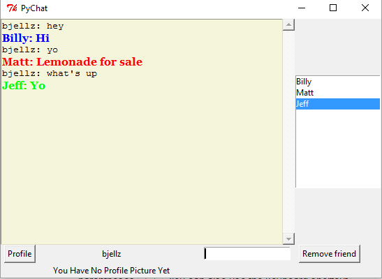

#Table Of Contents
  <ul>
    <li><a href="#What-is-this">What Is This</a></li>
    <li><a href="#Prerequisites">Prerequisites</a></li>
    <li><a href="#Quick-Start">Quick-Start</a></li>
    <li><a href="#Author">Author</a></li>
    <li><a href="#Screenshot">Screenshot</a></li>
    <li><a href="#Licensing">Licensing</a></li>
  </ul>
<a name="What-is-this"><h1>What Is This</h1></a>
  
A lightweight chat utility written in python

<a name="Prerequisites"><h1>Prerequisites</h1></a>
  <ul>
    <li>Download and install [Python](https://www.python.org/downloads/)Python</a> (v2.7.x works best)</li>
  </ul>
<a name="Quick-Start"><h1>Quick Start</h1></a>
<ul>
  * Clone this repo
  * Navigate to the directory containing the project and type <code>python pyedit.py</code>
  * Enter any user name to begin a chat session
</ul>
<a name="Author"><h1>Author</h1></a>
  
This project was written for fun and to learn python and the tkinter library.
  This project was authored by William Jellesma. 

<a name="Screenshot"><h1>Screenshot</h1></a>

<a name="Licensing"><h1>Licensing</h1></a>

This Project is licensed under the <a href="http://choosealicense.com/licenses/mit/">MIT License</a>

